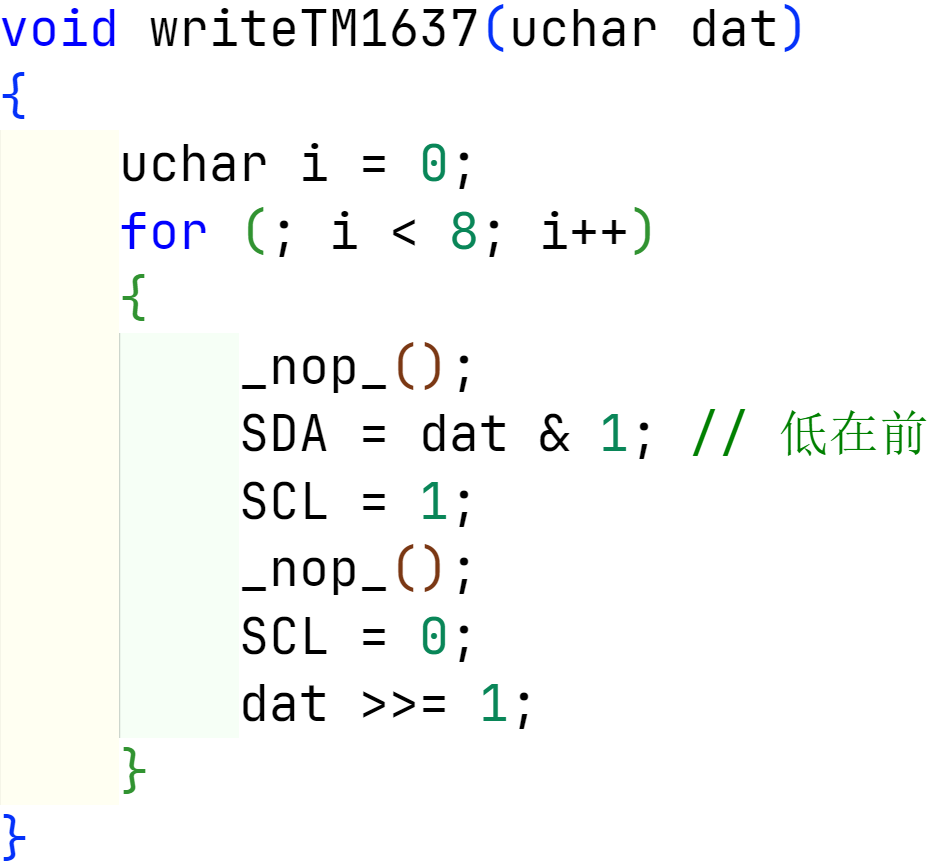
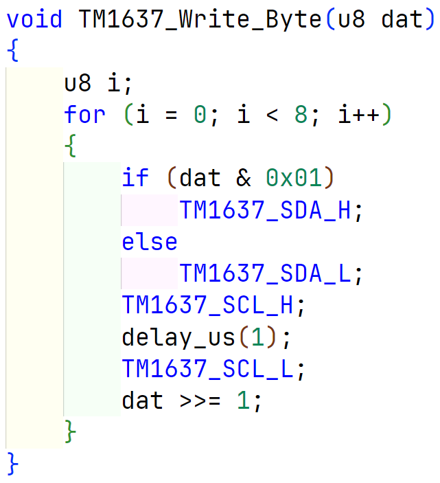
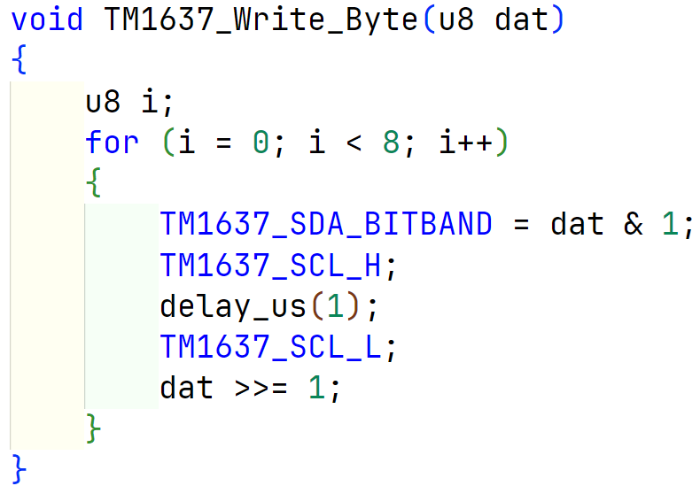
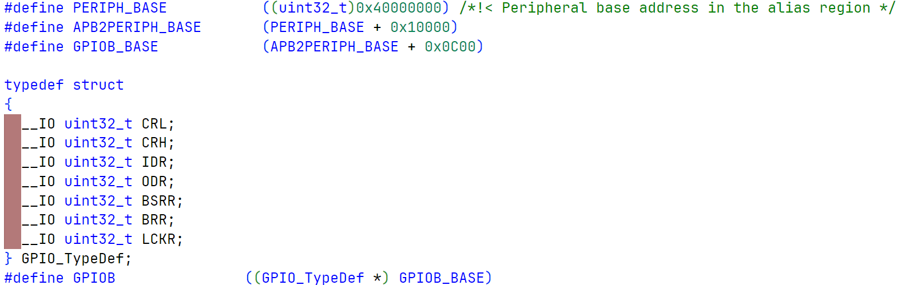
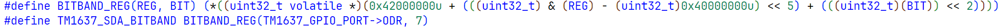

# TM1637用STM32F103C8驱动

## I2C

​	TM1637不是标准的I2C协议，本身没有从机地址，不能使用32自带的I2C硬件实现通信，只能使用软件模拟I2C协议。

## 位带操作

​	标准库使用函数对GPIO引脚控制，在一些场景中使用显得代码冗长，此时可以使用位带操作对GPIO直接位操作。

​	在对TM1637写入一字节函数中，用c51

​	用32库函数

​	位带操作

​	在Cortex-M3中有**两个区**实现了位带操作，其中一个是 **SRAM区**的最低 1MB 范围，第二个则是**片内外设区**的最低 1MB 范围。

​	这两个1MB将分别映射到另外两个地址区域：

​		**1.SRAM区的最低1MB**（0x2000 0000 --- 0x200F FFFF） 映射到（0x2200 0000 --- 0x23FF FFFF）。

​		**2.片内外设区的最低1MB**（0x4000 0000 --- 0x400F FFFF）映射到（0x4200 0000 --- 0x43FF FFFF）。

​	1个bit的映射地址占4个byte

​	**1.SARM区计算公式**

​		**AliasAddr** ＝ 0x22000000 + ((A‐0x20000000)*8+n)*4 = **0x22000000+(A-0x20000000)\*32 + n\*4**

​	**2.片上外设区计算公式**

​		**AliasAddr** ＝ 0x42000000 + ((A-0x40000000)*8+n)*4 = **0x42000000+(A-0x40000000)\*32 + n\*4**

​	这是标准库对基地址的宏定义

​	因此可得

- `volatile` 关键字是一种类型限定符，用于告诉编译器这个变量可能会在程序的控制之外被修改（例如，由硬件或其他线程）。因此，编译器在优化代码时不会假设这个变量的值在程序执行过程中是不变的，每次使用时都会从内存中重新读取。

## 注意点

1. 一开始要用TM1637设置数码管的亮度，否则默认亮度极有可能为0导致数码管不亮，从而导致自认为i2c协议代码编写不正确。
