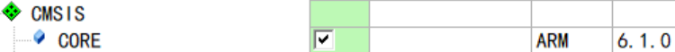
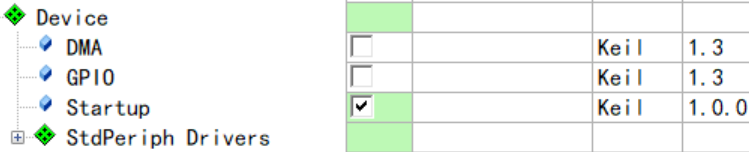
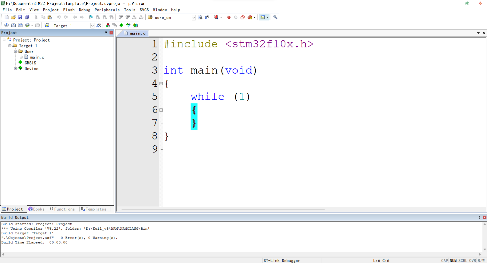
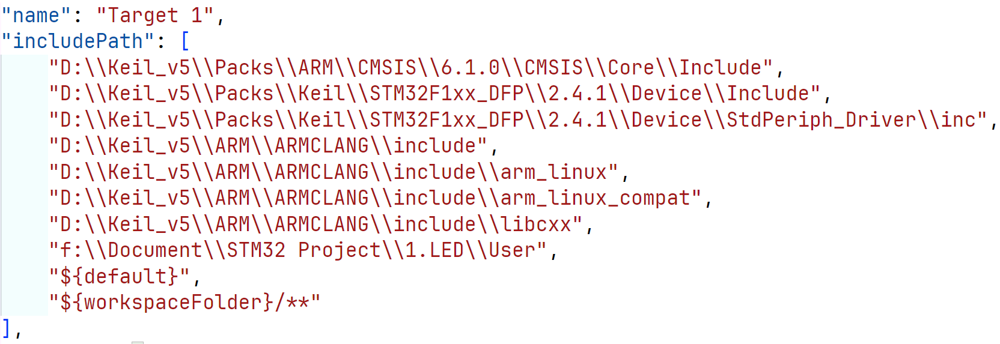

# Template

这是一个使用 keil 开发 STM32103C8 的模板工程。基于 Keil MDK540 版本，使用的库函数版本 2.4.1 来自于 keil 官网，安装于 keil 安装目录下。

## 库函数

该模板使用**Run-Time Environment**来配置库函数的使用。

### 内核

### Device

StdPeriph Drivers 全选，GPIO 未知。

## main

默认组 User，界面如下：

## 包含路径

keil 可以直接在其安装目录下找到头文件，而 vscode 不行，所以在 keil 中添加包含路径以便 vscode 可以跳转函数对应的头文件。

以 1.LED 为例，效果如下：

## 调试

使用 ST-Link

