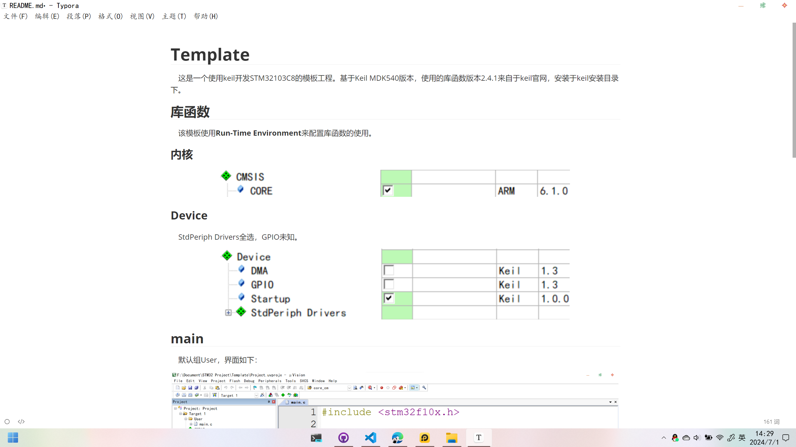
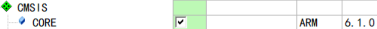
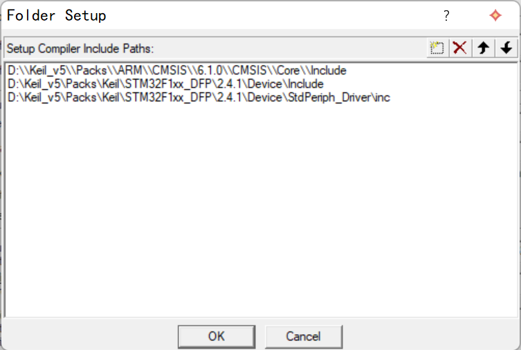
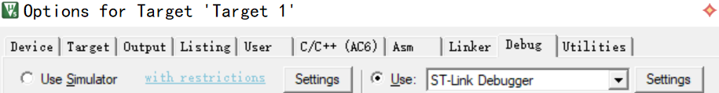

# Template

    这是一个使用keil开发STM32103C8的模板工程。基于Keil MDK540版本，使用的库函数版本2.4.1来自于keil官网，安装于keil安装目录下。

## 库函数

    该模板使用**Run-Time Environment**来配置库函数的使用。

### 内核

### Device

    StdPeriph Drivers全选，GPIO未知。

## main

    默认组User，界面如下：

## 包含路径

    keil可以直接在其安装目录下找到头文件，而vscode不行，所以在keil中添加包含路径以便vscode可以跳转函数对应的头文件。

    以1.LED为例，效果如下：

## 调试

    使用ST-Link

